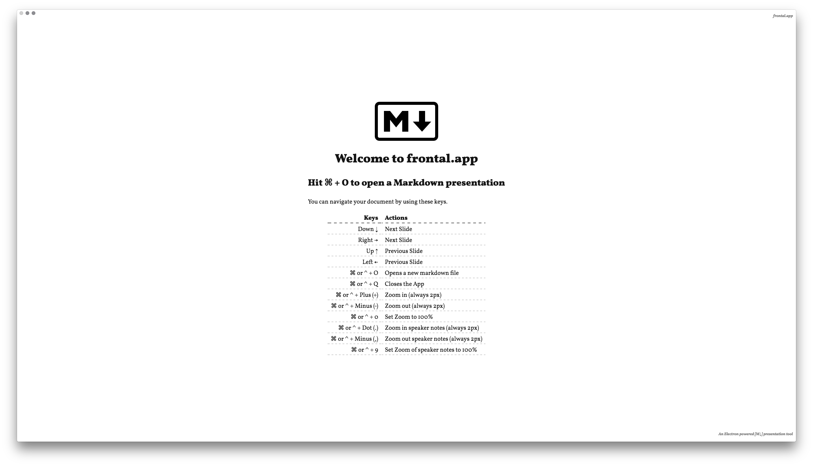
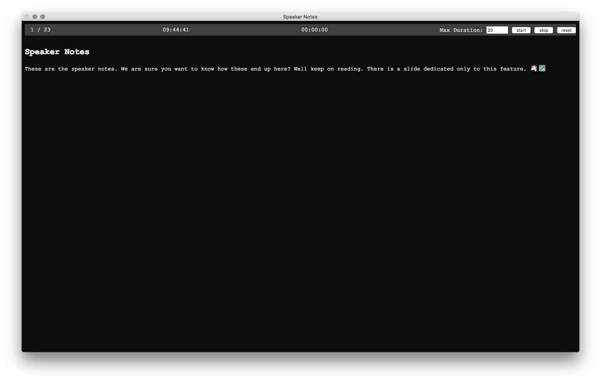

# frontal  

[](http://commitizen.github.io/cz-cli/) []() [](https://gitter.im/frntl/frontal)   

Markdown powered presentation tool build on Electron / Node.js  

---

  
  

---

## installation & run

Init the project by running:  

```bash
#install nodejs using homebrew 
brew install node
git clone git@github.com:frntl/frontal.git && cd frontal
# if you use nvm you can run
# nvm use
# if you are using mert you can run
# mert start
npm install
npm start
```


---


## development  

To write nice ES2015 style we use babel. Therefore we need to watch the whole `src/` and compile it to `app`. Run it like this in the root of the directory (additional files in the src folder will also be copied by babel into the `app/` folder):  

    npm run watch

To write on the scss you can run

    npm run sass

---

### installing additional modules  

For packing the app we use the [`electron-builder`](https://github.com/electron-userland/electron-builder) package. Therefor we have two package.json files. If you want to add another module (currently - will be improved) you will need to:  

    # dont do this while the watch task is running!
    cd app/
    npm install [your-module] --save && cat package.json ../src/package.json
    

---

## tests

To run the tests just do a  

    npm test


---

## build  

For buildung the distribution version we use the [`electron-builder`](https://github.com/electron-userland/electron-builder) package. To make this work we have two package.json files. One in the root for development (devDependencies) and one in the `src/` folder for distribution. Run  

    npm run dist

for building the package

---

## Related projects:

- [github.com/yhatt/marp](https://github.com/yhatt/marp/)  
- [github.com/ogom/sublimetext-markdown-slideshow](https://github.com/ogom/sublimetext-markdown-slideshow)  
- [remarkjs.com](http://remarkjs.com/#1)  
- [slidify.org](http://slidify.org/)  
- [jdan.github.io/cleaver](http://jdan.github.io/cleaver/#2)   
- [decksetapp.com](http://www.decksetapp.com/)  
- [swipe.to/markdown](https://www.swipe.to/markdown/)  

So why writing another app for this task? Well on the one hand it is for learning application development with electron. On the other hand we started this because all the other options did have one or the other thing that we didn't like. (And because we can)
